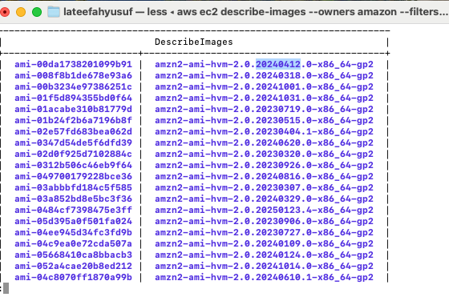

# Managing AWS Resources with Tagging Using AWS CLI

## Objectives
This guide walks through the process of managing AWS resources using tagging, filtering, and automation via the AWS Command Line Interface (CLI) and AWS SDK for PHP. 

- Apply tags to AWS resources.
- Find resources based on tags.
- Use AWS CLI and PHP scripts to start, stop, and terminate instances based on specific attributes.

## Prerequisites
- AWS account with necessary IAM permissions and an access key for CLI from an IAM user.
- AWS CLI installed and configured.
- PHP installed with AWS SDK for PHP.
- SSH client (PuTTY for Windows, Terminal for macOS/Linux).

## Step 1: Creating AWS Resources

### Create a New Access Key in AWS IAM

- In the search bar, type IAM and select IAM.
- Navigate to Users:
- Select your IAM user (or create a new one if needed).
- Create a New Access Key:
- Click Security credentials.
- Scroll down to Access Keys and click create access key.
- Choose the use case which is `CLI`
- Click Next and Create access key.
- Copy and Save the Keys:
Access Key ID: Visible in the AWS console.
Secret Access Key: Only shown once. Copy it and save it securely.

### Configuring AWS CLI

Run AWS CLI Locally to be able to run commands to create EC2 instances. You can install and configure AWS CLI on your local machine and run the commands directly.

- **Install AWS CLI**

**Windows:** Download and install from AWS CLI Installer
**Mac/Linux:** Run the following command and when asked for password, enter your pc laptop:

```sh
curl "https://awscli.amazonaws.com/AWSCLIV2.pkg" -o "AWSCLIV2.pkg"
sudo installer -pkg AWSCLIV2.pkg -target /
```

- **Configure AWS CLI**

```sh
aws configure
```

You'll be prompted to enter the details from the access key created from the IAM user:

AWS Access Key ID - 
AWS Secret Access Key - 
Default region - `Choose a default region of your choice`
Output format - `json`


### 1.1 Create a VPC

```sh
aws ec2 create-vpc \
--cidr-block 10.0.0.0/16 \
--tag-specifications 'ResourceType=vpc,Tags=[{Key=Name,Value=TestVPC}]'
```

**This command creates a VPC named `TestVPC` with CIDR `10.0.0.0/16`. Press `q` to exist the interface and run the next command.**

### 1.2 Create Subnets
`Replace `<vpc-id>` in both commands with **TestVPC** ID`

```sh
aws ec2 create-subnet \
--vpc-id <vpc-id> \
--cidr-block 10.0.1.0/24 \
--tag-specifications 'ResourceType=subnet,Tags=[{Key=Name,Value=PublicSubnet}]'
```

**Press `q` to exist the interface and run the next command.**

```sh
aws ec2 create-subnet \
--vpc-id <vpc-id> \
--cidr-block 10.0.2.0/24 \
--tag-specifications 'ResourceType=subnet,Tags=[{Key=Name,Value=PrivateSubnet}]'
```

**These commands create a public and a private subnet. Press `q` to exist the interface and run the next command.**

### 1.3 Create Security Groups
`Replace `<vpc-id>` in command below with **TestVPC** ID`

```sh
aws ec2 create-security-group \
--group-name TestSecurityGroup \
--description "Allow SSH and HTTP" \
--vpc-id <vpc-id>
```

### 1.4 Configure Security Groups
`Replace `<sg-id>` in both commands below with **TestSecurityGroup** ID from the result/output of the previous command`

```sh
aws ec2 authorize-security-group-ingress \
--group-id <sg-id> \
--protocol tcp --port 22 \
--cidr 0.0.0.0/0
```

```sh
aws ec2 authorize-security-group-ingress 
--group-id <sg-id> \
--protocol tcp \
--port 80 \
--cidr 0.0.0.0/0
```

### 1.5 Launch EC2 Instances
First, create a key pair for SSH access:

```sh
aws ec2 create-key-pair \
--key-name TestKey \
--query 'KeyMaterial' \
--output text > TestKey.pem
chmod 400 TestKey.pem
```

- Depending on your selected region, run this command to list available Amazon Linux 2 AMIs in your selected region when you ran `aws configure` earlier. I am working in the `eu-north-1` region. :

```sh
aws ec2 describe-images 
--owners amazon 
--filters "Name=name,Values=amzn2-ami-hvm-*-x86_64-gp2" --query 'Images[*].[ImageId,Name]' 
--output table
```

Now, launch the instances:

- Replace ami-00da1738201099b91 with the correct ami-id if your selected region is not `eu-north-1`.
- Replace `<sg-id>` in both commands below with **TestSecurityGroup** ID. Also, `<public-subnet-id>` and `<private-subnet-id>` with their respective IDs. 
- Press `q` to exist the interface and run the next command.

```sh
aws ec2 run-instances \
--image-id ami-00da1738201099b91 \
--count 1 \
--instance-type t3.micro \
--key-name TestKey \
--security-group-ids <sg-id> \
--subnet-id <public-subnet-id> \
--tag-specifications 'ResourceType=instance,Tags=[{Key=Name,Value=CommandHost}]'
```

```sh
aws ec2 run-instances \
--image-id ami-00da1738201099b91 \
--count 8 \
--instance-type t3.micro \
--key-name TestKey \
--security-group-ids <sg-id> \
--subnet-id <private-subnet-id> \
--tag-specifications 'ResourceType=instance,Tags=[{Key=Project,Value=ERPSystem},{Key=Version,Value=1.0},{Key=Environment,Value=development}]'
```

## Step 2: Managing Instances with Tags

### 2.1 Finding Development Instances

To find all instances in your account that are tagged with a tag of Project and a value of ERPSystem.

```sh
aws ec2 describe-instances \
--filters "Name=tag:Project,Values=ERPSystem" "Name=tag:Environment,Values=development" \
--query 'Reservations[*].Instances[*].InstanceId' \
--output text
```

### 2.2 Changing Version Tag for Development Process
In this procedure, you will change all of the Version tags on the instances marked as development for the project ERPSystem.

Create and edit a shell script:

```sh
mkdir -p ~/aws-scripts
nano ~/aws-scripts/change-resource-tags.sh
```

Paste the following content into the nano script:

```sh
#!/bin/bash

# Get the instance IDs of development instances in ERPSystem
ids=$(aws ec2 describe-instances \
    --filters "Name=tag:Project,Values=ERPSystem" "Name=tag:Environment,Values=development" \
    --query 'Reservations[*].Instances[*].InstanceId' \
    --output text)

# Check if ids variable is empty
if [[ -z "$ids" ]]; then
    echo "No instances found matching the criteria. Exiting..."
    exit 1
fi

# Apply the new tag
aws ec2 create-tags \
--resources $ids \
--tags Key=Version,Value=1.1 

echo "Version tag updated for instances: $ids"
```

**Press Control + C (^C) to save, Control + X (^X) to close the file, and then `Y` to exit nano then make it executable**

```sh
chmod +x ~/aws-scripts/change-resource-tags.sh
```

Run the script:

```sh
~/aws-scripts/change-resource-tags.sh
```

Verify the changes:

```sh
aws ec2 describe-instances \
    --filters "Name=tag:Project,Values=ERPSystem" "Name=tag:Environment,Values=development" \
    --query 'Reservations[*].Instances[*].InstanceId' \
    --output text
```

## Step 3: Stopping and Restarting Instances

### 3.1 Stopping Instances by Tag
If Homebrew is Not Installed, install Homebrew first using the command below. If not, move on to the next command

```sh
/bin/bash -c "$(curl -fsSL https://raw.githubusercontent.com/Homebrew/install/HEAD/install.sh)"
```

```sh
brew install php
brew install composer
php -v
composer --version
composer init --no-interaction
composer require aws/aws-sdk-php
nano stopinator.php
```

Paste this into the nano script, replace `eu-north-1` with your region:

```php
<?php
require 'vendor/autoload.php';
use Aws\Ec2\Ec2Client;

$ec2 = new Ec2Client(['region' => 'eu-north-1', 'version' => 'latest']);
$args = getopt("t:s");
$tags = explode(";", $args['t']);
$filters = array_map(fn($t) => ['Name' => "tag:" . explode("=", $t)[0], 'Values' => [explode("=", $t)[1]]], $tags);
$result = $ec2->describeInstances(['Filters' => $filters]);
$instanceIds = array_column($result['Reservations'][0]['Instances'], 'InstanceId');

if (isset($args['s'])) {
    $ec2->startInstances(['InstanceIds' => $instanceIds]);
} else {
    $ec2->stopInstances(['InstanceIds' => $instanceIds]);
}
?>
```

**Press Control + C (^C) to save, Control + X (^X) to close the file, and then `Y` to exit nano then make it executable**

```sh
php stopinator.php -t "Project=ERPSystem;Environment=development"
```

### 3.2 Starting Instances by Tag

```sh
php stopinator.php -t "Project=ERPSystem;Environment=development" -s
```

## Step 4: Terminating Non-Compliant Instances
Create and run a PHP script to terminate instances that do not have the required `Environment` tag.

Create and edit a script:

```sh
nano terminate-instances.php
```

Paste the following content:

```php
<?php
require 'vendor/autoload.php';
use Aws\Ec2\Ec2Client;

$ec2 = new Ec2Client(['region' => 'eu-north-1', 'version' => 'latest']);
$result = $ec2->describeInstances(['Filters' => [['Name' => 'tag-key', 'Values' => ['Environment']]]]);
$compliantInstances = array_column($result['Reservations'][0]['Instances'], 'InstanceId');
$result = $ec2->describeInstances();
$allInstances = array_column($result['Reservations'][0]['Instances'], 'InstanceId');
$nonCompliantInstances = array_diff($allInstances, $compliantInstances);

if (!empty($nonCompliantInstances)) {
    $ec2->terminateInstances(['InstanceIds' => $nonCompliantInstances]);
}
?>
```

**Press Control + C (^C) to save, Control + X (^X) to close the file, and then `Y` to exit nano then make it executable**

Run the script:

```sh
php terminate-instances.php
```

## Step 5: Deleting Resources
### Delete Instances

```sh
aws ec2 describe-instances \
--query 'Reservations[*].Instances[*].InstanceId' \ --output text | xargs aws ec2 terminate-instances \ --instance-ids
```

### Delete Security Groups

```sh
aws ec2 describe-security-groups \
--query 'SecurityGroups[*].GroupId' \
--output text | xargs -n1 aws ec2 delete-security-group \ --group-id
```

### Delete Subnets

```sh
aws ec2 describe-subnets \
--query 'Subnets[*].SubnetId' \
--output text | xargs -n1 aws ec2 delete-subnet \ --subnet-id
```

### Delete VPCs

```sh
aws ec2 describe-vpcs \
--query 'Vpcs[*].VpcId' \
--output text | xargs -n1 aws ec2 delete-vpc \
--vpc-id
```

### Delete Key Pairs

```sh
aws ec2 delete-key-pair --key-name TestKey
```

### Final Verification

```sh
aws ec2 describe-instances \
--query 'Reservations[*].Instances[*].InstanceId' \ --output table
aws ec2 describe-security-groups \
--query 'SecurityGroups[*].[GroupId,GroupName]' \
--output table
aws ec2 describe-vpcs \
--query 'Vpcs[*].[VpcId,Tags]' \
--output table
aws ec2 describe-subnets \
--query 'Subnets[*].[SubnetId,Tags]' \
--output table
```

---

## **General Troubleshooting Tips** 
If you encounter issues while following this guide, try these troubleshooting steps:

### **1️⃣ Check AWS CLI Configuration**
Run the following command to verify your AWS CLI settings:

```sh
aws configure list
```

Ensure that the **AWS Access Key, Secret Key, and Region** are correctly configured.

### **2️⃣ Verify AWS Resources Exist**
Check whether your instances, security groups, or VPCs exist:

```sh
aws ec2 describe-instances \
--query 'Reservations[*].Instances[*].[InstanceId, State.Name, Tags]'
```

If no instances appear, ensure you have created them in the correct AWS region.

### **3️⃣ Fix "Command Not Found" Errors**
If you see `command not found`, ensure that AWS CLI and PHP are installed:

```sh
aws --version
php -v
```

If missing, install them:

```sh
brew install awscli php   # For macOS (Homebrew)
sudo apt install awscli php   # For Ubuntu/Linux
```

### **4️⃣ Handle "Unsupported Configuration" Errors**
If your EC2 instance type is unsupported, find available types:

```sh
aws ec2 describe-instance-type-offerings \
--location-type availability-zone \
--query "InstanceTypeOfferings[*].InstanceType" \
--output table
```

Try launching a supported instance type, such as `t3.micro` 

### **5️⃣ Ensure Correct File Permissions**
If a script is not executable, fix permissions:

```sh
chmod +x script.sh
```

If `nano` gives a "No such file or directory" error, ensure you are in the correct directory:

```sh
pwd
ls -l
```

### **6️⃣ Check PHP Errors**
If PHP scripts fail, verify required dependencies:

```sh
composer install
```

If `vendor/autoload.php` is missing, ensure AWS SDK is installed:

```sh
composer require aws/aws-sdk-php
```

### **7️⃣ Confirm AWS Region**
If AWS commands return empty results, ensure the correct region is used:

```sh
aws configure get region
```

Manually specify the region if necessary:

```sh
aws ec2 describe-instances --region eu-north-1
```

### **8️⃣ Debugging AWS CLI Commands**
Use the `--debug` flag for detailed output:

```sh
aws ec2 describe-instances --debug
```

This helps diagnose permission or configuration issues.

---

Following these troubleshooting steps should resolve most common issues. If problems persist, check AWS documentation or seek support from AWS forums.

For further AWS training, visit [AWS Training and Certification](https://aws.amazon.com/training/).
